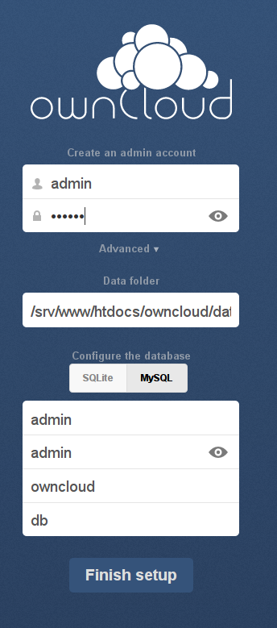

docker-linuxmag
===============

Beispieldateien zum Artikel 'Docker am Beispiel ownCloud'

Beispiel ausfuehren
===================

Um die Container im zu bauen und auszufuehren, wird das Programm `fig` benutzt,
zu finden unter http://www.fig.sh/

Beispielaufruf:

  # cd owncloud
  # ./build.sh
  # fig up # oder fig up -d

`build.sh` sorgt dafuer, das bestimmte Verzeichnisse fuer die Datenablage vorhanden und mit den
entsprechenden Zugriffsrechten versehen sind. Danach wird `fig build` ausgefuehrt.
Falls Sie Daten nicht unter /data abspeichern moechte, so muss das in `build.sh` sowie in der `fig.yml`
angepasst werden.

Datenbank Admin User und Passwort koennen ueber Umgebungsvariablen gesteuert werden, siehe 
`fig.yml`

Nach erfolgreichem Start sollten Sie nach `http://hostname-ihres-rechners/owncloud` navigieren
koennen, um das Setup fuer ownCloud abzuschliessen:

